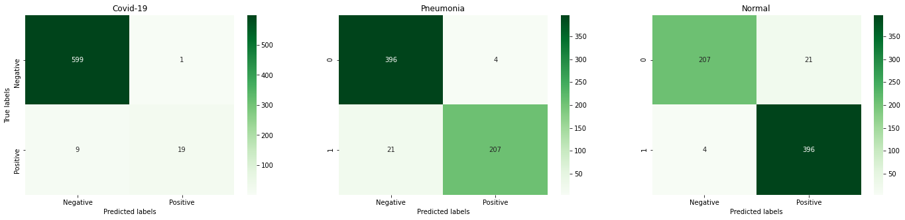
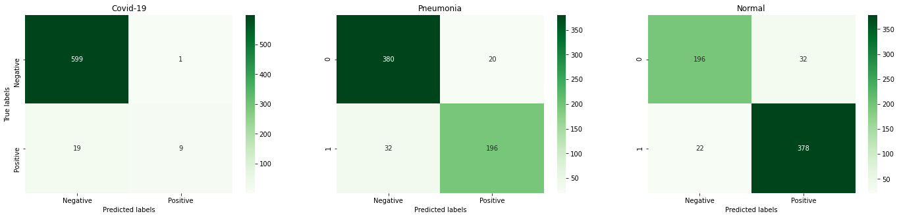

# Covid-19
The repository  holds the working on classification of normal and infected x-rays of lungs. 

Objectives: 
Write code for detecting infections such as COVID-19 among X-Ray images: 

1) Use CNN, pre-trained on ImageNet, to extract basic features from X-Ray images.
2) Train the classification layers in order to detect instances of Infected (COVID-19 + Pneumonia) and Normal X-Ray images.
Fine-tune the entire network to try to improve performance.

Chest X-Ray Images Dataset
Background:
New studies [1] have revealed that the damage done to lungs by infections belonging to the family of coronaviruses (COVID-19, SARS, ARDS etc.) can be observed in X-Ray and CT scan images. With a worldwide shortage of test kits, it is possible that careful analysis of X-Ray and CT scan images may be used in diagnosis of COVID-19 and for the regular assessment while they are recovering. In this assignment, we will use an open source dataset of X-Ray images and train a Convolutional Neural Network to try and detect instances of infections containing COVID-19 and Pneumonia.  
  
## Without Focal Loss:  
  
### Dataset:  
This dataset contains X-Ray images from 2 classes:  
Class: Infected & Normal  
In total there are 12000 Training, 1500 Validation and 1500 Testing samples.  
Two Models are used with pytorch VGG16 & resnet18  
The link for datset is as follows:  
https://drive.google.com/file/d/1-HQQciKYfwAO3oH7ci6zhg45DduvkpnK/view  
### VGG16  
With pretrained model Testing results are:  
F1 Score: 0.97  
Accuracy of the network on the images: 96 %  
  
### Resnet18  
With pretrained model Testing results are:  
F1 Score: 0.98  
Accuracy of the network on the images: 97 %  
  
  
## With Focal Loss:  
  
### Dataset:
It is a multilabel two class problem. There are 6200 labeled training and 628 validation samples however 629 unlabelled samples.  
Link for dataset is:  
https://drive.google.com/file/d/1eytbwaLQBv12psV8I-aMkIli9N3bf8nO/view  

### VGG-16:
F1 Score:95.97%  
  
  
  
Weights: https://drive.google.com/open?id=1NaThdsT3DGmzj7aKcJV6l922lfn7XmYb  
  
### VGG-16 With Focal Loss:  
F1 Score:  95.85%  
  
  
  
Weights: https://drive.google.com/open?id=1cs69MZxKkUDnr4QRN3kLY8IScoKBJOo0  
  
### Resnet-18
F1 Socre: 95.3%  
  
  
  
Weights: https://drive.google.com/file/d/1-2k9MPCdzcLhpsECiRMTKFugWSGp51gf/view?usp=sharing  
  
### Resnet-18 With Focal Loss:  
F1 Score: 90.9%  
  
  
  
Weights: https://drive.google.com/file/d/1-6RNfqVIulX1PQRfFKmqvNOJxEP7L1J8/view?usp=sharing  
